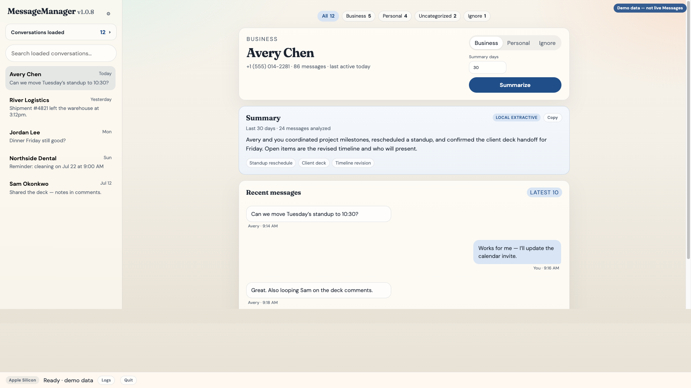
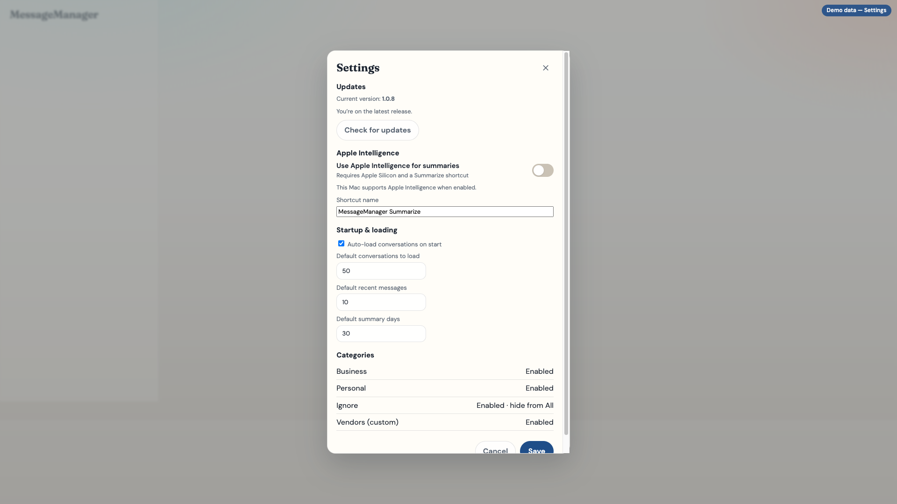

# MessageManager

Local macOS app for browsing, categorizing, and summarizing your iMessage conversations — entirely on your machine.

**Current release:** [v1.0.9](https://github.com/srtviperjr/MessageManager/releases/tag/v1.0.9)


## What it does

MessageManager reads a **read-only copy** of your Messages database, resolves names from Contacts when possible, lets you tag conversations, and generates on-device summaries.

| Area | Capabilities |
|---|---|
| Conversations | Load by count or recent activity; search; preview + recent messages |
| Categories | Business, Personal, Uncategorized, Ignore, plus custom categories |
| Summaries | Local extractive summarizer; optional Apple Intelligence (Apple Silicon + Shortcut) |
| Ops | Settings, in-app Logs, Quit, GitHub update checks |
| Privacy | `127.0.0.1` only; no message upload |

Detailed requirements: [REQUIREMENTS.md](REQUIREMENTS.md)  
Prompt history for this project: [docs/PROMPTS.md](docs/PROMPTS.md)

## Screenshots (demo data)

These use fictional test conversations — not a live Messages export.





Open the interactive fixture page locally: [docs/demo.html](docs/demo.html).

## Install (recommended)

1. Download **`MessageManager.pkg`** from the [latest GitHub Release](https://github.com/srtviperjr/MessageManager/releases/latest).
2. Open the package (unsigned builds: **right-click → Open** the first time, or System Settings → Privacy & Security → Open Anyway).
3. Finish the installer — the app always lands in **/Applications/MessageManager.app**.
4. If Python is missing, the installer installs Python 3.12 from python.org and app dependencies.
5. Grant **Full Disk Access** to **MessageManager**:
   - System Settings → Privacy & Security → Full Disk Access → enable MessageManager
   - Quit MessageManager completely, then open it again
6. A browser window opens to the local UI (`http://127.0.0.1:8741`).

### Updates

On launch (and under **Settings → Updates**), MessageManager checks GitHub Releases and can download the newer `MessageManager.pkg` for you. After installing an update, quit and reopen so migrations apply.

### Gatekeeper vs Full Disk Access

| Prompt | Meaning |
|---|---|
| “Untrusted developer” / can’t open | Gatekeeper — use right-click → Open (or notarize builds for a clean double-click) |
| Can’t read Messages / Contacts | Full Disk Access — required even for notarized apps |

There is no supported way to skip Gatekeeper for public unsigned downloads without Apple notarization (Developer ID + notary).

## Quick start after install

1. Choose how many conversations to load (or load by activity), then **Start loading**.
2. Use the chips at the top of the main pane to filter All / Business / Personal / Uncategorized / Ignore.
3. Select a conversation → review recent messages → set a category → **Summarize** (optional day range).
4. Use **Settings** for Apple Intelligence, auto-load defaults, and custom categories.
5. Use **Logs** in the status bar if something fails.

### Optional: Apple Intelligence summaries

On Apple Silicon only:

1. Create a Shortcut named **`MessageManager Summarize`** that receives text, runs **Summarize**, and outputs the result.
2. In MessageManager **Settings**, enable Apple Intelligence.

With the toggle on, failures are surfaced (no silent fallback to extractive).

## Development setup

```bash
git clone https://github.com/srtviperjr/MessageManager.git
cd MessageManager
python3 -m pip install --user -r requirements.txt
python3 run.py
```

Open [http://127.0.0.1:8741](http://127.0.0.1:8741).

Grant Full Disk Access to the app that launches Python (Terminal, Cursor, etc.). The packaged `.app` uses a native launcher that copies Messages + Contacts into Application Support so FDA applies reliably.

### Build the Mac app / installer

```bash
chmod +x scripts/create-macos-app.sh scripts/create-macos-installer.sh scripts/macos/launch.sh scripts/macos/pkg/postinstall
./scripts/create-macos-app.sh          # → dist/MessageManager.app (or dist/.build/…)
./scripts/create-macos-installer.sh    # → dist/MessageManager.pkg
```

Publish:

```bash
gh release create v1.0.9 dist/MessageManager.pkg \
  --title "MessageManager 1.0.9" \
  --notes "Release notes here"
```

Optional notarization (Apple Developer Program):

```bash
export CODESIGN_IDENTITY="Developer ID Application: Your Name (TEAMID)"
export INSTALLER_IDENTITY="Developer ID Installer: Your Name (TEAMID)"
export NOTARY_PROFILE="notary-profile"
./scripts/create-macos-installer.sh
```

## Architecture (short)

```
MessageManager.app (native launcher)
  → copy Messages + Contacts DBs into Application Support (under FDA)
  → launch.sh → local venv → uvicorn (127.0.0.1:8741) → browser UI
```

| Path | Role |
|---|---|
| `~/Library/Application Support/MessageManager/data/` | Categories, settings, migrations |
| `…/messages-cache/` | Copied `chat.db` |
| `…/contacts-cache/` | Copied AddressBook DBs |
| `…/logs/` | `launch.log`, `server.log`, `app.log` |

## Privacy

- Everything stays on your Mac.
- The server listens on localhost only.
- Categories and settings are local SQLite/JSON.
- Message content is read from temporary / cache copies of Apple’s databases and is never uploaded.
- Network use is limited to GitHub Releases (updates) and optional Python install during packaging setup.

## Continuing development on another Mac

1. Clone this repo (or pull `main`).
2. Install the latest release to verify runtime behavior, or run `python3 run.py` for UI work.
3. Read [REQUIREMENTS.md](REQUIREMENTS.md) and [docs/PROMPTS.md](docs/PROMPTS.md) for product scope and history.
4. After product changes, rebuild with `./scripts/create-macos-app.sh` before finishing.
5. Ship updates as GitHub Releases with asset name **`MessageManager.pkg`** (unversioned filename).

## License / ownership

Private use unless otherwise stated by the repository owner. Messages and Contacts data remain under your macOS account controls.
